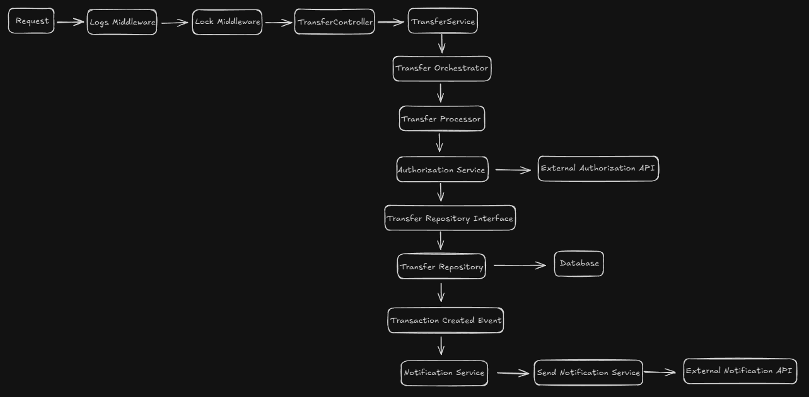

# Projeto de Plataforma de Pagamentos Simplificada

Este projeto é uma plataforma de pagamentos que permite transferências de dinheiro entre usuários e lojistas.  

## 🧑‍💻 Tecnologias Utilizadas
- **Laravel 12**
- **PHP-FPM 8.2**
- **Redis para Lock de Transações e Fila de Notificações**
- **Docker** & **Docker Compose**

## 🏗️ Arquitetura do Sistema



---

## 🔧 Componentes Principais

1. **Request:** A requisição chega na aplicação através da rota configurada.
2. **Redis Lock Middleware:** Garante que apenas uma transação por vez seja realizada para evitar concorrência.
3. **TransferController:** Recebe a requisição e valida os dados iniciais.
4. **TransferService:** Contém a lógica de negócio da transferência, realiza validações e utiliza serviços externos.
   - **AuthorizationService:** Realiza a verificação de autorização de transferência com um serviço externo.
   - **TransferRepository:** Responsável por interagir com o banco de dados.
   - **NotificationService:** Envia notificações sobre transferências bem-sucedidas. 
5. **Database:** Armazena os dados de transferências e usuários.
6. **External Notification API:** Utilizada para notificar os usuários ou lojistas sobre transferências realizadas.

---

## 🚀 Primeiros Passos

### ✅ Pré-requisitos

Certifique-se de que você tem o seguinte instalado:

- **Docker**
- **Docker Compose**
- **Composer** (opcional)

### 🛠️ Instalação

1. Clone este repositório e entre na pasta do projeto:
```bash
git clone https://github.com/RichardVsc/project.git && cd project
```

2. Suba os containers com Docker:
```bash
docker-compose up -d
```

3. Acesse o container:
```bash
docker exec -it project bash
```

4. Instale as dependências PHP via Composer:
```bash
composer install
```

5. Execute as migrations e os seeders:
```bash
php artisan migrate
php artisan db:seed --class=UserSeeder
```
6. Acesse a aplicação no navegador:
```bash
http://localhost:8080
```

7. Para verificar os usuários criados via seeder, use o Tinker:
```bash
php artisan tinker
App\Models\User::all();
```

## 🧪 Testes e Análise de Código

### Rodando os Testes
Para rodar todos os testes automatizados:
```bash
composer test
```

### Análise Estática de Código
Executa todas as ferramentas de análise de uma vez:
```bash
composer analyze
```

Ou utilize individualmente:
- PHPCS Fixer (formatação):
```bash
composer check
```

- PHPStan (análise estática):
```bash
composer phpstan
```

- PHPMD (más práticas):
```bash
composer phpmd
```

### Correção Automática
Corrigir automaticamente os problemas de formatação:
```bash
composer fix
```

## 💡 Dicas
- Se estiver com dúvidas sobre os comandos disponíveis, veja a aba "scripts" no arquivo composer.json.

- A pasta vendor/ e o arquivo composer.lock não devem ser editados manualmente.

- Sempre que adicionar novas dependências, lembre-se de rodar os testes e as ferramentas de análise.
